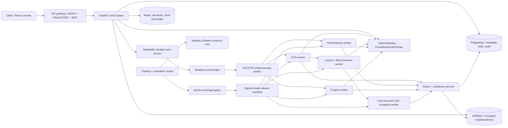
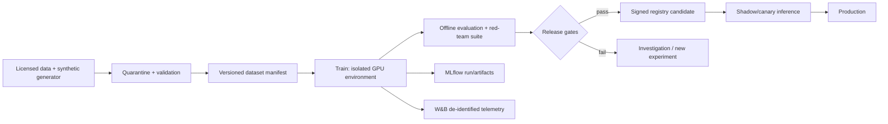

# Phase 1 — System Design

**Status:** Complete design baseline; implementation phases remain gated.

## 1. Purpose and non-goals

VeriVision AI verifies the consistency and authenticity of a government identity document and a selfie while extracting document fields with traceable evidence. It is a decision-support platform, not an autonomous legal identity authority. A human-review route is mandatory for ambiguous, low-quality, policy-sensitive, and novel-attack cases.

The platform accepts only tenant-authorized workflows. It does not use scraped biometrics, train on customer media by default, or return raw face embeddings. Production certification must be country- and document-template-specific; no global accuracy claim is valid.

## 2. Reference architecture



### Why this architecture exists

Identity verification is a fan-out/fan-in workload: document, selfie, fraud, and semantic analyses have distinct GPU needs, failure modes, and release cadences. A synchronous API accepts and reports state; durable workers do expensive work. The orchestrator reconciles idempotent evidence into a single auditable decision, avoiding a fragile monolithic inference endpoint.

### Service responsibilities

| Service | Runtime | Responsibility | Scaling boundary |
|---|---|---|---|
| `api` | FastAPI | auth, upload authorization, state reads, workflow initiation | CPU / request rate |
| `orchestrator` | Celery-compatible worker | state transitions, retries, fan-out/fan-in, dead-letter handling | queue depth |
| `preprocess-worker` | Python + OpenCV | quality gates, crop, orientation, deskew, derivative manifest | CPU with optional GPU |
| `ocr-worker` | Python + PaddleOCR/TrOCR | detection, recognition, token geometry | GPU memory / image rate |
| `layout-worker` | PyTorch | LayoutLMv3 field/entity classification and table structure | GPU memory |
| `vlm-worker` | vLLM/Transformers | constrained document QA and exception adjudication | GPU memory / token rate |
| `face-worker` | InsightFace runtime | detect, align, quality/liveness gate, embedding comparison | GPU/CPU SIMD |
| `forgery-worker` | PyTorch/ONNX | global/local manipulation scoring and heatmaps | GPU memory |
| `decision-service` | FastAPI | policy evaluation, calibration, reason-code assembly | CPU / policy latency |
| `review-console` | React | evidence-scoped human review and adjudication | concurrent reviewers |

## 3. Data design and retention

PostgreSQL stores non-media metadata. Object storage stores source uploads, encrypted derivatives, and evidence under tenant/workflow prefixes. A dedicated KMS key hierarchy separates tenants and biometric artifacts. Vector databases are deliberately excluded: identity verification is 1:1 comparison, not open-set person search.

| Table | Key fields | Constraints / purpose |
|---|---|---|
| `tenants` | `id`, `kms_key_ref`, `retention_policy_id` | tenant isolation and policy binding |
| `verification_cases` | `id`, `tenant_id`, `state`, `workflow_version`, `idempotency_key` | unique `(tenant_id,idempotency_key)` |
| `artifacts` | `id`, `case_id`, `kind`, `object_uri`, `sha256`, `media_type` | immutable object digest |
| `derivatives` | `id`, `artifact_id`, `transform_manifest_uri`, `sha256` | reproducible transforms |
| `model_releases` | `id`, `name`, `digest`, `mlflow_run_id`, `evaluation_digest` | immutable signed release |
| `inference_runs` | `id`, `case_id`, `model_release_id`, `status`, `trace_id` | one durable provenance record per run |
| `evidence` | `id`, `inference_run_id`, `type`, `confidence`, `payload_uri` | encrypted detailed payload |
| `decisions` | `id`, `case_id`, `outcome`, `policy_version`, `calibration_version` | append-only decision history |
| `review_tasks` | `id`, `case_id`, `reason_code`, `assignee`, `resolution` | dual-control review audit |
| `audit_events` | `id`, `tenant_id`, `actor`, `action`, `hash_chain` | append-only, tamper-evident trail |
| `deletion_requests` | `id`, `case_id`, `due_at`, `completed_at` | lifecycle and deletion proof |

Use row-level security keyed by `tenant_id`, immutable audit writes, migration-managed schema, and storage lifecycle policies. Expire raw media first; retain only de-identified aggregate metrics when contractually and legally permitted. Run PII detection/redaction before any sample reaches MLflow, W&B, or support systems.

## 4. Model flow and decisioning

1. Validate MIME, size, pixel dimensions, checksum, malware scan, and upload provenance.
2. Produce a lossless original and deterministic derivatives; assess blur, glare, crop, resolution, and occlusion.
3. Classify document type/template and detect document boundaries. Reject only deterministic unsupported/corrupt inputs; otherwise use review paths.
4. OCR detection/recognition produces geometry-backed text. Layout model and template rules extract fields; checksum and cross-field validation identify inconsistencies.
5. VLM handles bounded, schema-constrained question answering only where layout/rules cannot resolve an exception. It cannot make an unconstrained final decision.
6. Face service detects/aligned face, validates quality and passive/active liveness, then calculates one-to-one similarity with calibrated thresholding.
7. Forgery service combines global authenticity score and localized manipulation evidence; signal calibration is document-template and acquisition-channel specific.
8. Decision service applies workflow policy to calibrated signals, required evidence coverage, and explicit uncertainty. It returns approve, review, or reject with evidence provenance.

## 5. Training and research pipeline

Data enters a quarantined registry only after license, consent, geographical scope, PII classification, and leakage review. Dataset manifests are versioned with DVC or lakeFS and include sample digest, source, license, annotation schema, split assignment, and deletion linkage. Splits must be identity-disjoint for face data and issuer/template/time-disjoint where feasible for documents; near-duplicates are removed before splitting.

Every experiment records Git commit, container digest, data-manifest digest, seed, GPU/CUDA stack, model base revision, hyperparameters, metrics, and artifacts. MLflow is the authoritative model registry and promotion record; W&B is used for research visualization, sweeps, tables, and media only after de-identification. Promotion requires reproducibility, held-out performance, calibration, slice parity, robustness, latency, security, and rollback checks.



## 6. Inference reliability, performance, and capacity targets

The following are SLO design targets to validate in Phase 8, not performance claims. Baseline target hardware is NVIDIA L4 (24 GB), CUDA 12.x, 8 vCPU, and 32 GB RAM per GPU worker. Use separate pools: OCR/layout (L4), VLM (L40S 48 GB or A100 80 GB for high concurrency), and face/forgery (L4). Development minimum: one 24 GB GPU; QLoRA research minimum: one 48 GB GPU, with multi-GPU FSDP/DeepSpeed for full experiments.

| Path | Target p95 async completion | GPU memory planning | Notes |
|---|---:|---:|---|
| Quality + preprocessing | 1.0 s | 0–2 GB | CPU-first, deterministic |
| OCR + layout extraction | 3.5 s | 8–16 GB | batch only homogeneous shapes |
| Face + passive liveness | 1.5 s | 2–8 GB | strict alignment/quality gate |
| Forgery analysis | 2.5 s | 4–12 GB | include heatmap only when needed |
| VLM exception path | 6.0 s | 16–40 GB | invoked selectively, schema constrained |
| Full standard case | 8.0 s | worker-pool dependent | VLM excluded unless exception |

Queue backpressure, per-tenant quotas, timeouts, circuit breakers, retry policies, and DLQs are mandatory. Make every consumer idempotent using the event and case keys. GPU workers expose queue age, batch size, CUDA memory, utilization, model digest, and OOM/retry counters.

## 7. Deployment topology

Local development uses Docker Compose with MinIO, PostgreSQL, Redis, RabbitMQ, MLflow, and isolated CPU/GPU worker profiles. Production uses Kubernetes: API/control services on CPU nodes; model workers on tainted GPU nodes with resource limits; PostgreSQL and RabbitMQ as managed HA services; S3-compatible object storage with versioning and cross-region recovery. NGINX/Ingress terminates mTLS/TLS and enforces request-size, rate, and WAF rules.

Build immutable, non-root containers; pin base images by digest; generate SBOMs; sign images and model manifests; scan vulnerabilities in CI. Deploy models as versioned canaries with shadow evaluation and automatic rollback for error-rate, drift, or latency regressions. ONNX Runtime/TensorRT are post-baseline optimization paths, only after numerical parity is measured against the PyTorch reference.

## 8. Observability, experiment tracking, and incident response

OpenTelemetry propagates a trace from upload through every worker. Prometheus provides RED metrics plus GPU and queue metrics; Loki stores JSON logs with PII-safe correlation IDs; Tempo retains sampled traces. Alert on SLO burn, DLQ growth, missing model provenance, calibration drift, high review rate, slice degradation, policy/model mismatch, and data-deletion failure.

MLflow stores parameters, metrics, checkpoints, evaluation reports, registered versions, and approval evidence. W&B is restricted to de-identified research projects and disabled in privacy-restricted environments. Neither tracker receives raw uploads, OCR text, document IDs, names, selfies, embeddings, or heatmaps unless they have undergone an approved privacy transformation.

## 9. Security and abuse model

Threats include replay, upload malware, decompression bombs, prompt injection in document text, model extraction, embedding theft, cross-tenant data access, poisoned training data, threshold manipulation, and sophisticated print/screen/deepfake presentation attacks. Controls are content-type sniffing, antivirus/CDR sandboxing, pixel/zip limits, presigned-upload scopes, OIDC/RBAC/ABAC, KMS envelope encryption, secret manager, mTLS, WAF/rate limits, request signing, isolated model workers, dependency/model provenance, dataset review, and adversarial evaluation.

Treat all document text as untrusted. VLM prompts use a fixed system instruction and typed schema; document text is data, never executable instruction. Enforce JSON Schema outputs, allowlisted tool access, maximum tokens, output sanitization, and audit logging. Conduct a DPIA/privacy review and jurisdiction-specific biometric legal review before real-user deployment.

## 10. Versioning, CI/CD, and quality gates

Version code with Git; package releases with semantic versions; pin dependencies with hashes/lockfiles; version data manifests independently; and identify models by immutable weight/config/tokenizer digest. A production decision records all five: code, workflow/policy, dataset lineage where applicable, model, and calibration version.

PR CI runs formatting, type checks, unit/integration/contract tests, migration checks, OpenAPI diff checks, dependency/SBOM/security scanning, secret scanning, container build, and lightweight model smoke tests using non-PII fixtures. Protected release pipelines run reproducibility checks, benchmark regression tests, load tests, inference numerical parity tests, model-card validation, signed artifact publication, staged deployment, canary analysis, and rollback verification.

## 11. Repository layout

```text
VeriVision-AI/
├── backend/                 # FastAPI control plane and decision service
├── services/                # independently deployable workers
├── packages/                # contracts, shared policy-safe utilities
├── datasets/                # manifests only; no raw/PII data
├── synthetic_data/          # generators, templates, provenance
├── preprocessing/           # deterministic image pipeline
├── ocr/                     # OCR training/inference/evaluation
├── layout_understanding/    # LayoutLMv3 and document structure
├── vlm/                     # Qwen2.5-VL constrained QA
├── lora_training/           # PEFT, QLoRA, distributed recipes
├── face_verification/       # 1:1 verification and liveness
├── forgery_detection/       # authenticity/localization research
├── benchmarking/            # offline and load benchmarks
├── deployment/              # Compose, Helm, manifests, dashboards
├── docker/                  # hardened image definitions
├── docs/architecture/       # ADRs and system design
├── research/                # experiment protocols and papers
├── experiments/             # declarative run configurations
├── tests/                   # unit, integration, contract, e2e
└── .github/workflows/       # CI/CD definitions
```

## 12. Phase 1 acceptance checklist

- [x] Trust boundaries, services, state machine, and contracts defined.
- [x] PII/biometric storage, retention, deletion, and logging rules defined.
- [x] Database entities, model provenance, and audit constraints defined.
- [x] Training-to-registry-to-canary promotion path defined.
- [x] Hardware envelopes, SLO targets, scaling, telemetry, and security model defined.
- [x] Repository structure, versioning, CI/CD, and phase gates defined.
- [ ] Architecture review sign-off by product/security/ML owners (required before Phase 2).

## 13. Research baseline for this phase

- [Vaswani et al., *Attention Is All You Need*](https://arxiv.org/abs/1706.03762) — transformer systems baseline.
- [Xu et al., *LayoutLMv3: Pre-training for Document AI with Unified Text and Image Masking*](https://arxiv.org/abs/2204.08387).
- [Liu et al., *Grounding DINO: Marrying DINO with Grounded Pre-Training for Open-Set Object Detection*](https://arxiv.org/abs/2303.05499).
- [Deng et al., *ArcFace: Additive Angular Margin Loss for Deep Face Recognition*](https://arxiv.org/abs/1801.07698).
- [Hu et al., *LoRA: Low-Rank Adaptation of Large Language Models*](https://arxiv.org/abs/2106.09685).
- [Dettmers et al., *QLoRA: Efficient Finetuning of Quantized LLMs*](https://arxiv.org/abs/2305.14314).
- [NIST Face Recognition Vendor Test (FRVT)](https://pages.nist.gov/frvt/html/frvt_facerecognition.html) reports for biometric evaluation methodology.

Upstream repositories to evaluate in later phases: [PaddleOCR](https://github.com/PaddlePaddle/PaddleOCR), [Transformers](https://github.com/huggingface/transformers), [PEFT](https://github.com/huggingface/peft), [Accelerate](https://github.com/huggingface/accelerate), [Microsoft UniLM](https://github.com/microsoft/unilm), [Qwen2.5-VL](https://github.com/QwenLM/Qwen2.5-VL), [InsightFace](https://github.com/deepinsight/insightface), [MLflow](https://github.com/mlflow/mlflow), and [OpenTelemetry](https://github.com/open-telemetry/opentelemetry-python).

## 14. Explicit Phase 2 entry criteria

Phase 2 begins only after the Phase 1 sign-off checklist is accepted and a data governance owner approves the data inventory template, license-review workflow, consent requirements, retention policy, and de-identification controls. No public or private dataset is downloaded into the repository before that gate.
