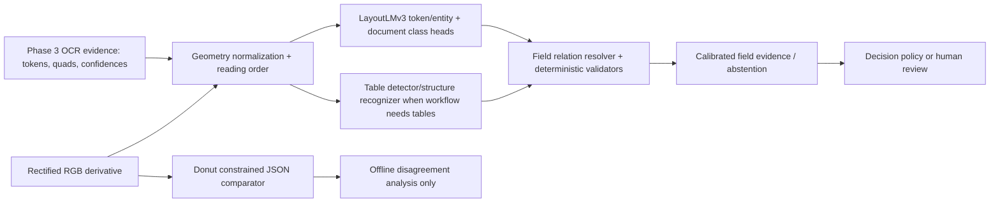

# Phase 4 — Document Understanding

**Status:** Contract, model registry, training recipe, geometry conversion, and evaluator implemented. GPU model training is pending a supported Python 3.11/Linux CUDA environment and Phase 2-approved manifests.

## Why this component exists

OCR says what text was recognized; document understanding says what each text span *means* in its visual context. It classifies document family/template, assigns token entities (name, document number, DOB, expiry), resolves key-value relations, validates field format/checksums, detects tables where applicable, and provides source-backed evidence to the policy layer. It must preserve OCR provenance and never turn an unsupported generated value into a fact.

## Architecture

`layoutlm_bbox` is implemented in `layout_understanding/src/verivision_layout/geometry.py`. It maps OCR quadrilaterals to LayoutLMv3's 0–1000 input coordinates while preserving the original quad in evidence. LayoutLMv3 uses text, layout, and image modalities, and its official implementation provides fine-tuning examples for form understanding, receipt understanding, document VQA, document classification, and layout analysis. [Official repository](https://github.com/microsoft/unilm/tree/master/layoutlmv3), [Hugging Face documentation](https://huggingface.co/docs/transformers/en/model_doc/layoutlmv3)

## Model choices and trade-offs

| Model | Use | Strength | Limitation | Decision |
|---|---|---|---|---|
| LayoutLMv3-base | token classification and document classification | direct OCR-word/box/image fusion, auditable span-level output, mature fine-tuning paths | depends on OCR quality and 512-token windowing | **Primary.** |
| Donut | constrained document-to-JSON extraction | OCR-free, useful disagreement signal and synthetic-data ecosystem | generated fields can hallucinate; weaker source-token traceability | offline comparator/exception research only. |
| DocFormer | multimodal ablation | strong joint text/vision/spatial research design | reproducible release and serving path must be verified | research reproduction only. |
| Table transformer / PP-Structure | table detection/structure | specialized cell/row/column handling | unnecessary for standard ID-card fields | invoke only for invoice/statement workflows. |

Donut's official project uses an OCR-free visual encoder/decoder and treats extraction as JSON prediction; this makes it useful as a bounded comparator but inappropriate as the sole evidence source for identity decisions. [Donut](https://github.com/clovaai/donut)

## Data, annotations, and preprocessing

Use canonical Phase 2 manifests and immutable OCR release digests. Token labels are BIOES at word level with entity types `PERSON_NAME`, `DOCUMENT_NUMBER`, `DATE_OF_BIRTH`, `ISSUE_DATE`, `EXPIRY_DATE`, `ADDRESS`, `ISSUER`, `NATIONALITY`, and workflow-specific fields. Every entity includes its constituent OCR token IDs, original quadrilateral union, normalized value, raw restricted value URI, model confidence, validator results, and annotation provenance.

Split by template family and capture session, not random page. Train LayoutLMv3 from `microsoft/layoutlmv3-base`; encode RGB pages, BPE text, 0–1000 boxes, word-to-subtoken labels (`-100` for continuation subtokens), and attention masks. Long documents use page-level processing plus a deterministic cross-page aggregator; do not silently truncate identities/expiry fields beyond 512 tokens.

Data sources: first-party fictitious documents are primary; MIDV data is benchmark-only until terms are approved; FUNSD/CORD/XFUND are transfer/evaluation sources under their own licenses. Tables are outside the core ID-card flow but trained/evaluated for invoices and statements in a separate workflow.

## Field extraction and validation

The model proposes entity spans. A resolver builds key-value candidates using reading order, spatial proximity, label anchors, template priors, and confidence. Deterministic validators then parse dates, permitted alphabets, field length, checksum algorithms when lawfully available, and inter-field constraints such as date ordering. Validation may lower confidence or route review; it does not rewrite model text. Document class must meet a calibrated threshold before template-specific rules run.

## Evaluation and experimentation

`layout_understanding/src/verivision_layout/evaluate.py` evaluates exact normalized entity pairs and document classification accuracy from JSONL. It reports micro metrics and per-entity slices; add span-overlap metrics for annotations where tokenization differs. The evaluation suite must also measure field exact match, relation F1, table TEDS/cell F1, calibration ECE/Brier, abstention risk-coverage, latency, GPU memory, and source/template/capture-language slices.

Benchmark sequence: (1) frozen OCR + LayoutLMv3 baseline, (2) OCR-release ablation, (3) LayoutLMv3 fine-tune, (4) synthetic-to-held-out-template transfer, (5) Donut constrained-comparator disagreement study, and (6) table component only for table-bearing workflows. Log model/data/OCR/calibration digests to MLflow and only de-identified aggregate metrics to W&B.

## Expected challenges and optimization

- OCR box drift propagates into entities: track OCR release as a first-class dependency and audit detector/recognizer changes.
- Similar templates create leakage: hold out visual/template families and near-duplicate clusters.
- BPE subtoken alignment and 512-token limits cause silent label errors: unit-test alignment and report truncation rate.
- Synthetic layouts overfit: vary template grammar/capture effects and evaluate on held-out renderer families.
- Use mixed precision, gradient checkpointing, gradient accumulation, dynamic padding, and GPU shape bucketing after correctness baselines. Export only after output/field parity, calibration, and latency validation.

## Deployment

Serve LayoutLMv3 behind the asynchronous worker boundary. Bundle processor, tokenizer, label map, config, calibration model, and release manifest atomically. Input requests refer to immutable OCR evidence and derivative URI; output is an evidence record, never a final approval. Batch by page size/token length with bounded queues; emit trace IDs, model/OCR digests, truncation, abstention, latency, and CUDA-memory metrics—never raw text in telemetry.

## Research papers and repositories

- [LayoutLMv3](https://arxiv.org/abs/2204.08387), [UniLM implementation](https://github.com/microsoft/unilm/tree/master/layoutlmv3).
- [DocFormer](https://arxiv.org/abs/2106.11539).
- [Donut](https://arxiv.org/abs/2111.15664) and [official repository](https://github.com/clovaai/donut).
- [Table Transformer](https://arxiv.org/abs/2110.00061) for table detection/structure recognition.

## Phase 4 exit criteria

- [x] Layout-aware input/output contract, model decision, training recipe, geometry conversion, and evaluator implemented.
- [x] Table scope and VLM evidence limitations defined.
- [ ] Train and evaluate LayoutLMv3 baseline using an approved manifest and pinned OCR release.
- [ ] Publish locked-set entity/classification/calibration/latency slices and error taxonomy.
- [ ] Run a constrained Donut comparison and record disagreement review.
- [ ] Package a signed model bundle and validate inference parity in the supported GPU runtime.

The current desktop environment cannot close GPU-runtime gates: it has Python 3.14 only, no NVIDIA GPU exposed, and no Paddle/PyTorch/Transformers runtime. The required benchmark environment is Linux, Python 3.11, CUDA-compatible NVIDIA GPU (L4 24 GB minimum for baseline), pinned container/model digests, and approved non-PII or consented manifests.
