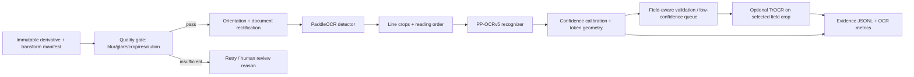

# Phase 3 — OCR Pipeline

**Status:** Architecture, evaluation engine, and model registry implemented. Runtime model benchmarking is gated on Phase 2-approved, quarantined data.

## Why OCR exists

OCR converts pixel evidence into text *with geometry and confidence*. That provenance is essential for field extraction, rule validation, explainable review, and tamper triage. OCR must never silently become a generative text guess: every extracted value needs source coordinates, engine confidence, image derivative digest, and model digest.

## Production architecture



The default is PP-OCRv5 detection + recognition with orientation and rectification. PaddleOCR 3.x offers PP-OCRv5 and deployment paths including ONNX Runtime; its current documentation advertises multilingual support and the OCR pipeline. [PaddleOCR](https://github.com/PaddlePaddle/PaddleOCR), [pipeline documentation](https://paddlepaddle.github.io/PaddleOCR/main/en/version3.x/pipeline_usage/OCR.html)

TrOCR is not a detector; it takes a cropped line/field and autoregressively recognizes it. Use it as a specialist only when the production error analysis identifies high-value fields (for example, stylized document numbers) where it demonstrably beats PP-OCRv5 within the latency budget. [TrOCR documentation](https://huggingface.co/docs/transformers/model_doc/trocr)

## Model comparison and decision

| Approach | Strength | Material limitation | VeriVision decision |
|---|---|---|---|
| PaddleOCR / PP-OCRv5 | detector + recognizer, quadrilateral geometry, multilingual deployment ecosystem | requires target-domain calibration/fine-tuning | **Primary production OCR.** |
| TrOCR | strong transformer recognizer for cropped text, fine-tunable | no document detection/layout; autoregressive latency and hallucinated characters need controls | selective field specialist and benchmark candidate. |
| Donut | direct image-to-structured output and SynthDoG ecosystem | no independent OCR-token evidence; schema hallucination risk | comparator/Phase 4 structured extraction, not primary OCR. |
| Nougat | scientific PDF and mathematical-document parsing | domain mismatch for ID cards, cards, mobile captures, and identity fields | excluded from primary flow. |
| OCRFormer | useful research comparator if a maintained reproducible implementation is verified | release/runtime maturity must be independently reproduced | deferred; not a production dependency. |

## Data and fine-tuning plan

Use Phase 2 manifests only. Maintain source/template/capture-disjoint splits. Start from official PP-OCRv5 weights and run baseline evaluation before fine-tuning. Fine-tune detection only if document-boundary/text-region recall fails; fine-tune recognition when error slices show persistent script/font/field gaps. TrOCR is trained only on crop-level ground truth with a fixed tokenizer/normalization policy and held-out template families.

Training records include the full derivative digest, crop coordinates, raw transcript in the restricted store, normalized transcript, script, field type, source, split, and annotation version. Do not substitute ambiguous characters (e.g., `O→0`) during ground-truth scoring. Field-specific normalization is reported separately from literal CER/WER.

## Evaluation and benchmark protocol

The executable evaluator at `ocr/src/verivision_ocr/evaluate.py` accepts prediction JSONL and emits corpus-weighted CER/WER, field exact match, and field-type slices. It deliberately uses Unicode NFKC normalization and avoids hiding OCR errors through blanket character substitution.

Required benchmark matrix:

| Dimension | Required values |
|---|---|
| Engine | PP-OCRv5 baseline; PP-OCRv5 fine-tune; TrOCR specialist; Donut comparator |
| Document family | MIDV/mock ID, first-party synthetic, receipt/form transfer, consented capture when approved |
| Capture | scan, mobile photo, perspective, low light, glare, blur, JPEG/WebP, screen/reprint |
| Language/script | Latin plus approved Devanagari/other target scripts |
| Field class | name, date, number, address, machine-readable/barcode-adjacent text |
| Metrics | CER, WER, literal exact match, field-normalized exact match, line recall/precision, p50/p95 latency, GPU memory, cost/page |

Acceptance targets are set only after an audited baseline; no fabricated accuracy threshold is claimed. Promotion requires locked-set metrics, bootstrap confidence intervals, slice metrics, calibration, latency/memory report, numerical-parity evidence after optimization, and a human-review analysis for low confidence.

## Implementation details

- OCR evidence contract: `artifact_id`, derivative SHA-256, model/config digest, token/line quadrilaterals, raw and normalized text, confidence, script/language, reading order, preprocessing manifest, and latency breakdown.
- Reject corrupt media deterministically; route low-quality but valid images to capture retry/review rather than inventing text.
- Maintain detector and recognizer version independently; changing either requires a new composite OCR release digest.
- Store raw OCR in restricted evidence storage. Logs and MLflow/W&B use digests, aggregate metrics, and approved redacted samples only.
- Use confidence calibration per field/template/capture cohort. An engine probability is not a final correctness probability.

Run evaluation with:

```text
PYTHONPATH=ocr/src python -m verivision_ocr.evaluate predictions.jsonl \
  --model-name paddle_pp_ocrv5 --model-version <immutable-digest> \
  --output reports/ocr/paddle_pp_ocrv5.json
```

## Optimization and deployment

Use dynamic batching only for similar line-crop aspect ratios. Keep detector images and recognizer crops separately batched; enforce bounded queues and per-stage deadlines. Profile reference PyTorch/Paddle inference first, then validate FP16, TensorRT, and ONNX Runtime against text/geometry parity on locked data. For identity documents, use the server model on GPU and a mobile model only when benchmarked latency/accuracy trade-offs justify it.

Expose Prometheus metrics for pages, lines, blank outputs, low-confidence rate, CER proxy from adjudicated feedback, p50/p95 stage latency, GPU utilization/memory, queue age, model digest, and retries. Do not put OCR text in metric labels.

## Expected challenges

- Security fonts, holograms, patterned backgrounds, and glare cause detector and recognizer failures differently; diagnose them independently.
- Synthetic data can teach renderer artifacts; hold out template/generator/capture families and use consented capture evaluation when available.
- Multilingual script coverage must be evaluated at grapheme level, not an English-only aggregate CER.
- A VLM may return plausible but unsupported text. It remains an exception tool with schema/provenance controls, not an OCR replacement.

## Papers and repositories

- [PP-OCRv5](https://arxiv.org/abs/2603.24373) and [PaddleOCR](https://github.com/PaddlePaddle/PaddleOCR).
- [TrOCR](https://arxiv.org/abs/2109.10282) and [Transformers implementation](https://huggingface.co/docs/transformers/model_doc/trocr).
- [Donut](https://arxiv.org/abs/2111.15664) and [SynthDoG implementation](https://github.com/clovaai/donut).
- [Nougat](https://arxiv.org/abs/2308.13418) and [official implementation](https://github.com/facebookresearch/nougat).
- [DBNet](https://arxiv.org/abs/1911.08947) for differentiable-binarization text detection.

## Phase 3 exit criteria

- [x] Primary architecture, source-safe evaluation contract, model registry, and deterministic evaluator implemented.
- [x] Model alternatives and deployment trade-offs documented.
- [ ] Approved data manifests are available in quarantine.
- [ ] Baseline PP-OCRv5 inference is reproduced from a pinned container/model digest.
- [ ] Locked-set benchmark report contains accuracy, calibration, latency, memory, and slice results.
- [ ] Fine-tuning decision is supported by measured baseline failure slices.

No model is represented as production-ready until the operational benchmark gates pass.
